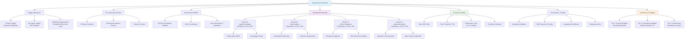

# Assessment Structure Visualization

```mermaid
graph TD
    A[Assessment Framework] --> B[Trigger Mechanism]
    A --> C[Pre-Assessment Phase]
    A --> D[Assessment Window]
    A --> E[Assessment Structure]
    A --> F[Scoring & Grading]
    A --> G[Performance Tracking]
    A --> H[Certification & Badging]

    B --> B1[Primary Trigger<br/>Scenario Completion]
    B --> B2[Secondary Trigger<br/>70% Progress]
    B --> B3[Mandatory Requirement<br/>Complete Before Next Level]

    C --> C1[2-Minute Cooldown]
    C --> C2[Performance Metrics Preview]
    C --> C3[Transition Screen]

    D --> D1[48-Hour Completion Window]
    D --> D2[One-Time Attempt]
    D --> D3[Auto-Save Every 3 Questions]

    E --> E1[Section A:<br/>Legal Knowledge<br/>10 MCQs, 10 min, 20%]
    E --> E2[Section B:<br/>Case Analysis<br/>6 Questions, 15 min, 30%]
    E --> E3[Section C:<br/>Ethical Judgment<br/>5 Questions, 10 min, 25%]
    E --> E4[Section D:<br/>Argument Quality<br/>2 Questions, 10 min, 25%]

    E1 --> E1A[Single-Select MCQ]
    E1 --> E1B[Knowledge Testing]

    E2 --> E2A[Case-Based Reasoning]
    E2 --> E2B[Evidence Interpretation]

    E3 --> E3A[Situational Judgment]
    E3 --> E3B[Ethical Decision-Making]

    E4 --> E4A[Argument Deconstruction]
    E4 --> E4B[Open-Ended Justification]

    F --> F1[Total: 100 Points]
    F --> F2[Pass Threshold: 70%]
    F --> F3[Performance Tiers<br/>A+ to F Grades]
    F --> F4[Excellence Bonuses]

    G --> G1[Immediate Feedback]
    G --> G2[Skill Taxonomy Tracking]
    G --> G3[Longitudinal Dashboard]
    G --> G4[Weakness Alerts]

    H --> H1[Tier 1: Scenario Badges<br/>Bronze/Silver/Gold]
    H --> H2[Tier 2: Competency Badges<br/>Evidence Master, etc.]
    H --> H3[Tier 3: Certifications<br/>Foundation to Expert]

    style A fill:#e1f5fe
    style E fill:#f3e5f5
    style F fill:#e8f5e8
    style H fill:#fff3e0
```